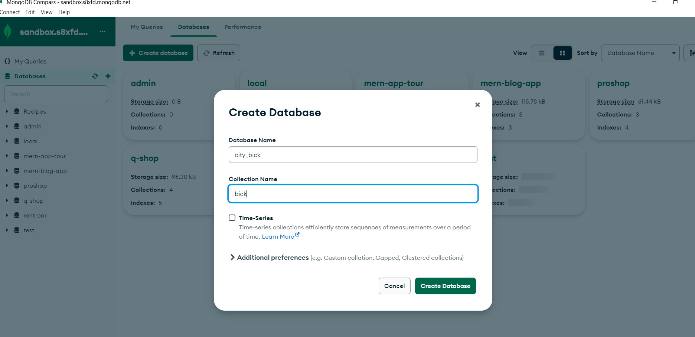
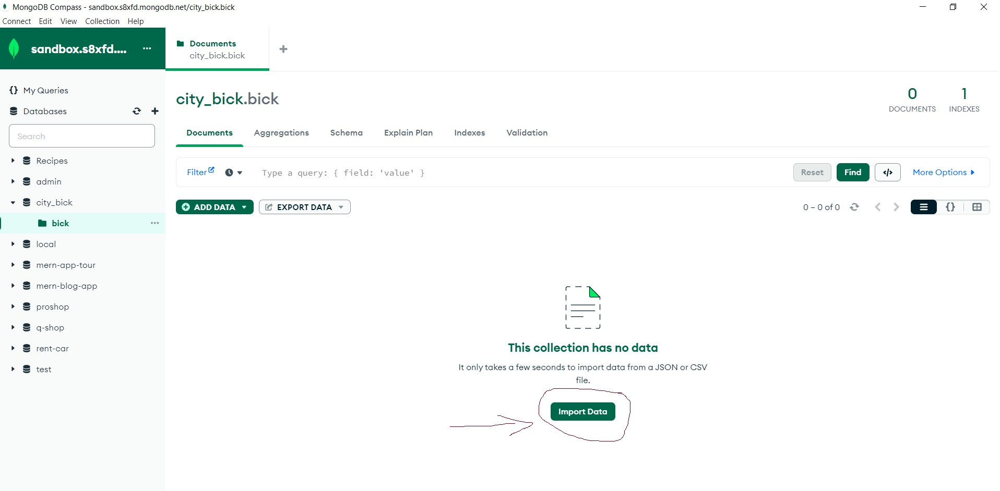
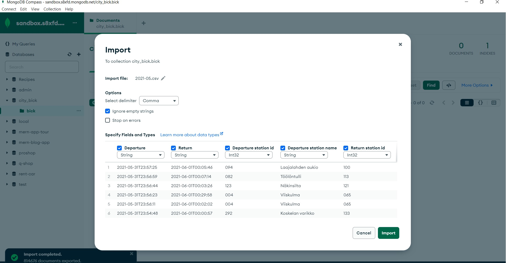
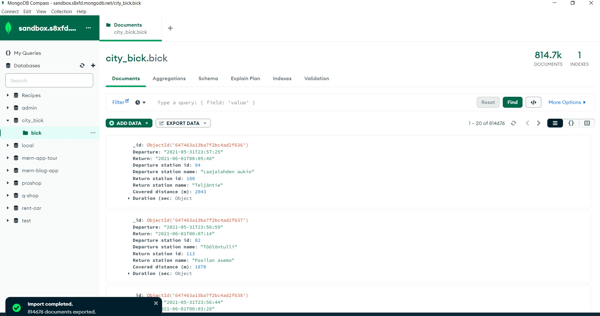
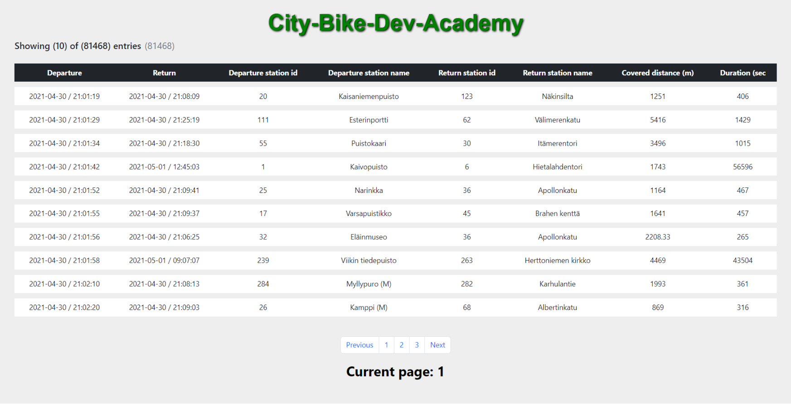

## City-Bike-Dev-Academy-task

## Installation

1- Clone the repo

```bash
https://github.com/capo33/City-Bike-Dev-Academy
```

2- Install dependencies

```bash
yarn
```

3- Create .env file

4- Add your own data in .env file

```bash
PORT= your PORT ex: 5000
MONGODB_URI = your MONGODB URI ex: mongodb://localhost:27017/city-bike
```

5- Download CSV file

- <https://dev.hsl.fi/citybikes/od-trips-2021/2021-05.csv>

6- Create database



6- Upload CSV file to your database




6- Now you should have the data like so



## Usage

1- Go to the root directory and start the server

```
yarn start
```

## Frontend

1- Have a look to the frontend repo

```bash
https://github.com/capo33/City-Bike-Dev-Academy-frontend
```



## Tech

- [node.js]
- [Express]
- [MongoDB]
- [Typescript]

## License

MIT

[MongoDB]: https://account.mongodb.com/account/login?n=%2Fv2%2F606da19c07b1ef3925ab02d2&nextHash=%23clusters
[node.js]: http://nodejs.org
[express]: http://expressjs.com
[Typescript]: https://www.typescriptlang.org/
